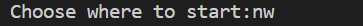

# Dungeon Run

Dungeon Run is a text-based adventure game where the user is either assigned a character or creates their own with the purpose of escaping the dungeon. 
While navigating thru the dungeon, the player needs to cross several cells.  
Behind every door is a monster/troll/skeleton that needs to be defeated before entering the next cell. 
There are two built-in roles that the user can use to create its character, Knight and Mage. 
The user can also choose its characters appearence,such as Muscular, 
Meager, ragged or bald. 
During the adventure in the dungeon, there are two types of monsters that can appear, Skeleton and Troll. 
Damage taken and health is represented for the user during combat.
The combat system is built on a feature that randomly decides who the winner is.

# Game play instructions
## Step 1

When starting the game the user will be directed to the main menu, where the player will be given three options.
(See picture below)

If the user wants to create a new hero, the user will be promted to write down a name for the new hero.
The new hero will be saved to a jsonfile so that the player at a later time can choose the same character.

## Step 2

To choose one of the following characters simply write down the heros name (See picture below)
. 
. 

## Step 3
The game has 3 different mapsizes (small 4x4), (medium 5x5) and (Large 8x8). 
To choose the requested size simply write down the size in letters. (See picture below)

## Step 4

In this step, the game will ask the player from wich corner of the chosen map the player wants to start from.

* Nortwest  - "nw"
* Northeast - "ne"
* Southwest - "sw"
* Southeast - "se"

To choose the requested position simply write down the two letters that represents the requested position.
(See picture below)

 
 
 

## Step 5 
The user now gets a graphic image of the map with the requested position to start from.
The "@" represents the heros position so that the user can see alternative routes.
To navigate in the map the user has been given four alternatives

W = Forward.  
A = Left. 
S = Back. 
D = Right. 
Q = Quit
 

 
 
 

## Step 6  
When entering a cell the user faces its challenger and two alternatives are given.
 
 
1. Attack. 
 
2. Defend
 
 
The winner of the combat is not something the user can influence, as the winner is randomly chosen by the game.